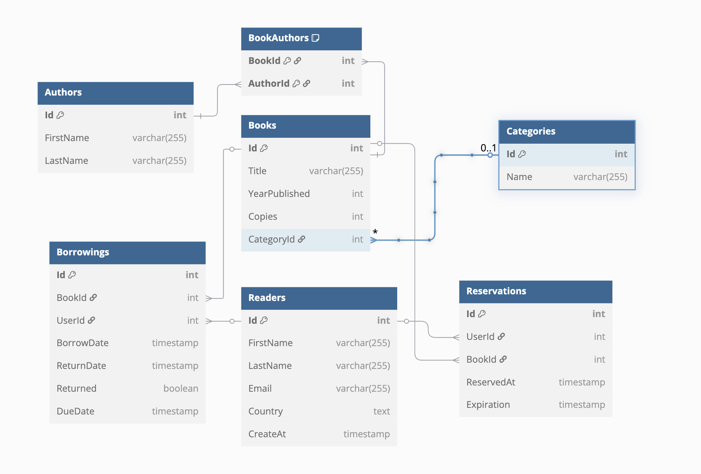

# PO2-projekt – System Zarządzania Biblioteką

## Opis projektu

Aplikacja desktopowa do zarządzania biblioteką, napisana w technologii .NET (Avalonia UI) z wykorzystaniem Entity Framework Core oraz bazy danych PostgreSQL. Pozwala na zarządzanie książkami, autorami, kategoriami, czytelnikami, wypożyczeniami oraz rezerwacjami. Projekt zawiera przykładowe dane (seed) dla łatwiejszego testowania funkcjonalności.

## Baza danych



## Wymagania

- [.NET 9.0 SDK](https://dotnet.microsoft.com/en-us/download/dotnet/9.0)
- [PostgreSQL](https://www.postgresql.org/) (domyślnie: `localhost:5432`, baza: `LibraryDB`, użytkownik: `postgres`, hasło: `Dabrowski08`)
- System operacyjny: Windows, Linux lub macOS

## Instalacja i uruchomienie

1. **Sklonuj repozytorium:**
   ```bash
   git clone <adres_repozytorium>
   cd PO2-projekt
   ```

2. **Utwórz bazę danych PostgreSQL:**
   ```bash
   createdb -U postgres LibraryDB
   ```
   *(lub użyj narzędzia graficznego, np. pgAdmin)*

3. **Zastosuj migracje i wprowadź dane startowe:**
   ```bash
   dotnet tool install --global dotnet-ef
   dotnet ef database update
   ```

4. **Uruchom aplikację:**
   ```bash
   dotnet run
   ```

   Aplikacja uruchomi się jako program desktopowy.

## Konfiguracja

Połączenie do bazy danych znajduje się w pliku `appsettings.json`:
```json
{
  "ConnectionStrings": {
    "DefaultConnection": "Host=localhost;Port=5432;Database=LibraryDB;Username=postgres;Password=Dabrowski08"
  }
}
```
W razie potrzeby zmień dane dostępowe do bazy.

## Technologie

- Avalonia UI (desktop, MVVM)
- Entity Framework Core (ORM)
- PostgreSQL (baza danych)
- .NET 9.0 
